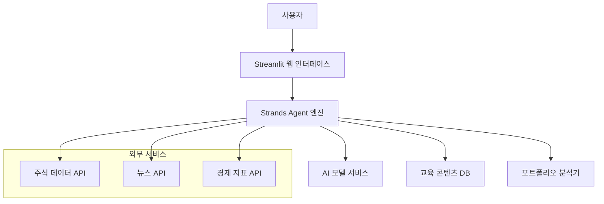

# 설계 문서

## 개요

초보 주식투자자를 위한 Streamlit 기반 Strands Agent 서비스는 AI 에이전트를 활용하여 사용자 친화적인 웹 인터페이스를 통해 투자 교육과 조언을 제공하는 시스템입니다. 이 시스템은 Streamlit의 간단한 배포와 인터랙티브한 UI 기능을 활용하여 초보자도 쉽게 접근할 수 있는 투자 도우미를 구현합니다.

## 아키텍처

### 전체 시스템 아키텍처



### 레이어 구조

1. **프레젠테이션 레이어**: Streamlit 기반 웹 UI
2. **비즈니스 로직 레이어**: Strands Agent 엔진 및 투자 분석 로직
3. **데이터 액세스 레이어**: 외부 API 연동 및 데이터 처리
4. **외부 서비스 레이어**: 주식 데이터, 뉴스, AI 모델 서비스

## 컴포넌트 및 인터페이스

### 1. Streamlit 웹 인터페이스 (UI Layer)

**주요 컴포넌트:**
- `ChatInterface`: 사용자와 AI 에이전트 간의 대화 인터페이스
- `StockInfoPanel`: 주식 정보 표시 패널
- `PortfolioAnalyzer`: 포트폴리오 분석 결과 표시
- `EducationModule`: 투자 교육 콘텐츠 표시
- `MarketOverview`: 시장 동향 대시보드

**인터페이스:**
```python
class StreamlitUI:
    def render_chat_interface() -> None
    def display_stock_info(stock_data: StockData) -> None
    def show_portfolio_analysis(portfolio: Portfolio) -> None
    def render_education_content(content: EducationContent) -> None
    def display_market_overview(market_data: MarketData) -> None
```

### 2. Strands Agent 엔진 (Business Logic Layer)

**주요 컴포넌트:**
- `ConversationManager`: 대화 흐름 관리
- `IntentClassifier`: 사용자 의도 분류
- `ResponseGenerator`: AI 기반 응답 생성
- `InvestmentAdvisor`: 투자 조언 생성기
- `EducationProvider`: 교육 콘텐츠 제공자

**인터페이스:**
```python
class StrandsAgent:
    def process_user_input(user_input: str) -> AgentResponse
    def get_stock_analysis(ticker: str) -> StockAnalysis
    def generate_portfolio_advice(user_profile: UserProfile) -> PortfolioAdvice
    def provide_education_content(topic: str) -> EducationContent
    def interpret_market_news(news_data: List[NewsItem]) -> MarketInsight
```

### 3. 데이터 서비스 (Data Access Layer)

**주요 컴포넌트:**
- `StockDataService`: 주식 데이터 조회 서비스
- `NewsService`: 뉴스 데이터 수집 서비스
- `MarketDataService`: 시장 지표 데이터 서비스
- `UserProfileService`: 사용자 프로필 관리 서비스

**인터페이스:**
```python
class DataService:
    def get_stock_data(ticker: str) -> StockData
    def fetch_market_news(limit: int = 10) -> List[NewsItem]
    def get_market_indicators() -> MarketIndicators
    def save_user_profile(profile: UserProfile) -> bool
    def load_user_profile(user_id: str) -> UserProfile
```

## 데이터 모델

### 핵심 데이터 모델

```python
@dataclass
class StockData:
    ticker: str
    company_name: str
    current_price: float
    price_change: float
    price_change_percent: float
    volume: int
    market_cap: float
    pe_ratio: Optional[float]
    week_52_high: float
    week_52_low: float
    
@dataclass
class UserProfile:
    user_id: str
    risk_tolerance: str  # 'conservative', 'moderate', 'aggressive'
    investment_goal: str
    investment_horizon: str  # 'short', 'medium', 'long'
    experience_level: str  # 'beginner', 'intermediate', 'advanced'
    
@dataclass
class PortfolioAdvice:
    recommended_allocation: Dict[str, float]  # sector -> percentage
    risk_assessment: str
    explanation: str
    suggested_stocks: List[str]
    
@dataclass
class AgentResponse:
    message: str
    response_type: str  # 'text', 'stock_info', 'portfolio', 'education'
    additional_data: Optional[Dict]
    confidence_score: float
```

### 교육 콘텐츠 모델

```python
@dataclass
class EducationContent:
    topic: str
    level: str  # 'beginner', 'intermediate', 'advanced'
    content: str
    examples: List[str]
    key_points: List[str]
    next_topics: List[str]
```

## 오류 처리

### 오류 처리 전략

1. **API 연결 오류**
   - 재시도 메커니즘 (최대 3회)
   - 대체 데이터 소스 활용
   - 사용자에게 친화적인 오류 메시지 표시

2. **데이터 검증 오류**
   - 입력 데이터 유효성 검사
   - 잘못된 주식 티커 처리
   - 범위를 벗어난 값 처리

3. **AI 모델 오류**
   - 모델 응답 검증
   - 기본 응답 템플릿 제공
   - 신뢰도 점수 기반 응답 필터링

### 오류 처리 구현

```python
class ErrorHandler:
    def handle_api_error(self, error: APIError) -> str
    def handle_validation_error(self, error: ValidationError) -> str
    def handle_model_error(self, error: ModelError) -> str
    def log_error(self, error: Exception, context: Dict) -> None
```

## 테스트 전략

### 테스트 레벨

1. **단위 테스트**
   - 각 컴포넌트의 개별 기능 테스트
   - 데이터 모델 검증 테스트
   - 비즈니스 로직 테스트

2. **통합 테스트**
   - API 연동 테스트
   - 컴포넌트 간 상호작용 테스트
   - 데이터 플로우 테스트

3. **UI 테스트**
   - Streamlit 컴포넌트 렌더링 테스트
   - 사용자 인터랙션 시뮬레이션
   - 반응형 디자인 테스트

4. **성능 테스트**
   - API 응답 시간 테스트
   - 동시 사용자 처리 테스트
   - 메모리 사용량 모니터링

### 테스트 도구

- **단위 테스트**: pytest
- **API 테스트**: requests-mock
- **UI 테스트**: streamlit-testing
- **성능 테스트**: locust

### 테스트 데이터

```python
class TestDataFactory:
    def create_sample_stock_data() -> StockData
    def create_sample_user_profile() -> UserProfile
    def create_mock_api_responses() -> Dict
    def create_education_content_samples() -> List[EducationContent]
```

## 보안 고려사항

### 데이터 보호

1. **개인정보 보호**
   - 사용자 프로필 데이터 암호화
   - 세션 기반 데이터 관리
   - 민감한 정보 로깅 방지

2. **API 보안**
   - API 키 환경변수 관리
   - 요청 속도 제한
   - 입력 데이터 검증 및 새니타이징

3. **면책 조항**
   - 투자 조언 면책 조항 표시
   - 데이터 정확성 한계 명시
   - 사용자 책임 고지

### 보안 구현

```python
class SecurityManager:
    def encrypt_user_data(self, data: Dict) -> str
    def validate_input(self, user_input: str) -> bool
    def sanitize_input(self, user_input: str) -> str
    def check_rate_limit(self, user_id: str) -> bool
```

## 배포 및 운영

### 배포 전략

1. **Streamlit Cloud 배포**
   - GitHub 연동을 통한 자동 배포
   - 환경변수 관리
   - 도메인 설정

2. **로컬 개발 환경**
   - Docker 컨테이너 기반 개발
   - 개발용 API 키 관리
   - 핫 리로드 설정

### 모니터링

1. **애플리케이션 모니터링**
   - 사용자 세션 추적
   - API 호출 빈도 모니터링
   - 오류 발생률 추적

2. **성능 모니터링**
   - 응답 시간 측정
   - 메모리 사용량 모니터링
   - 동시 접속자 수 추적